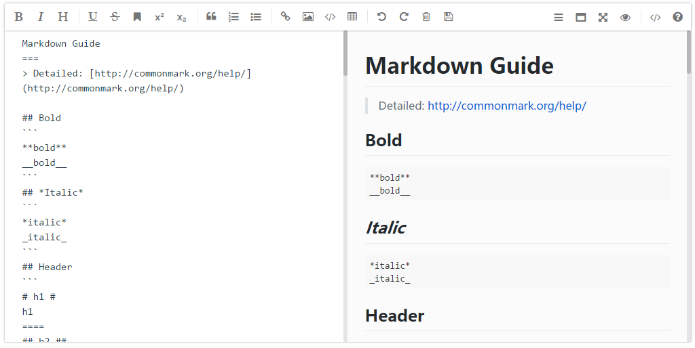
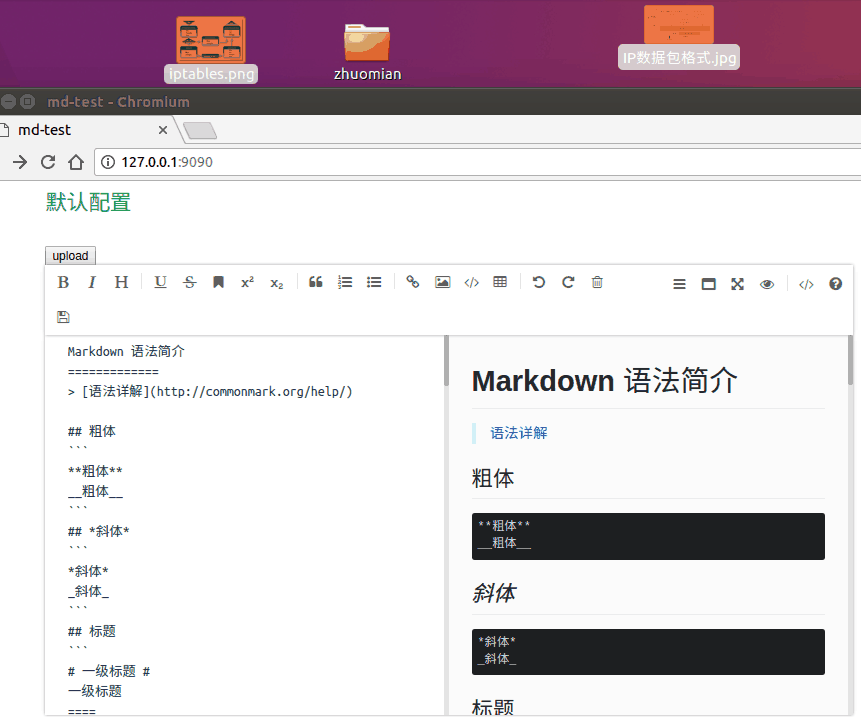
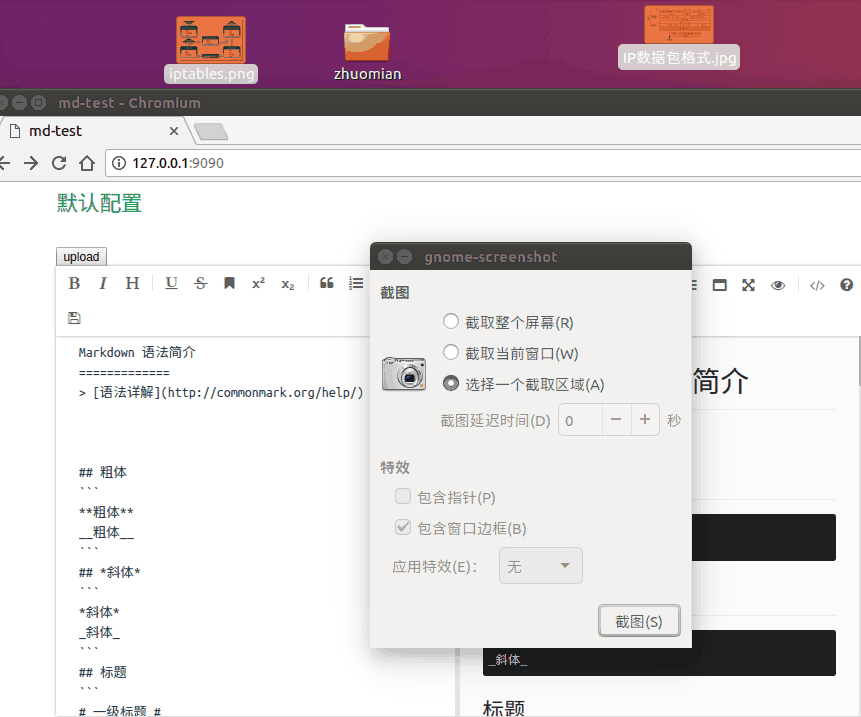
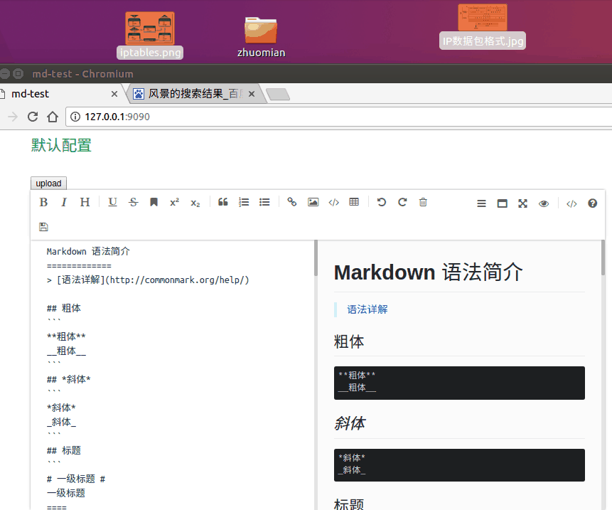
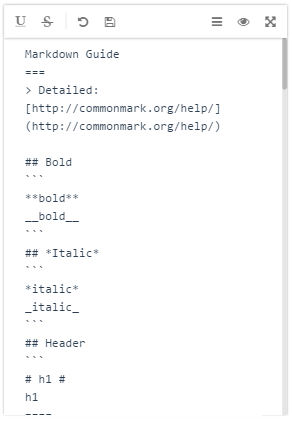
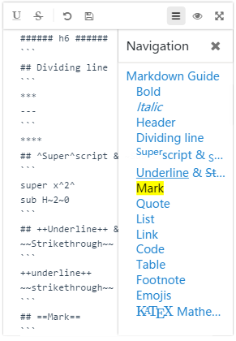

# mavonEditor


> A markdown editor based on Vue

### [中文说明](./README.md)

## Example Pictures
### PC




### Images Preview








### Mobile


&nbsp;&nbsp;&nbsp;


## Use Setup

### Install mavon-editor
```
$ npm install mavon-editor --save
```

#### Webpack

For optimize the size of pack, since v2.0.0 `hightlight.js` will on-demand load highlight files, you should pack highlight files(`mavon-editor/dist/js/*.js`) manual.
If you are using webpack , you sould config `webpack` as shown below
`webpack.conf.js`:
```javascript
//...
var lang = require('highlight.js-async-webpack/src/file.lang.hljs.js');
var _entry= {
    back_end: './src/back-end/index.js',
    vue: ['vue']
};
for (var i = 0; i < lang.length; i++) {
    _entry[lang[i]] = ['mavon-editor/dist/js/' + lang[i] + '.js']
}
//...
module.exports = {
    entry: _entry,
    output: {
        path: path.resolve(__dirname, './dist'),
        filename: 'js/[name].js',
        //...
    },
    //...
}
```

### Use

#### method 1
`index.js`:
```javascript
    // Global Registration
    // import with ES6
    import Vue from 'vue'
    import mavonEditor from 'mavon-editor'
    import 'mavon-editor/dist/css/index.css'

    // use
    Vue.use(mavonEditor)
    new Vue({
        'el': '#main',
        data() {
            return { value: '' }
        }
    })
```
`index.html`
```html
<div id="main">
    <mavon-editor v-model="value"/>
</div>
```

#### method 2
`index.js`:
```javascript
    // Global Registration
    // require with Webpack/Node.js
    var Vue = require('vue')
    var mavonEditor = require('mavon-editor')
    import 'mavon-editor/dist/css/index.css'

    // use
    Vue.use(mavonEditor)
    new Vue({
        'el': '#main',
        data() {
            return { value: '' }
        }
    })
```
`index.html`
```html
<div id="main">
    <mavon-editor v-model="value"/>
</div>
```

#### method 3
`editor.vue`:
```javascript
    <template>
        <div id="editor">
            <mavon-editor style="height: 100%"></mavon-editor>
        </div>
    </template>
    <script>
    // Local Registration
    import { mavonEditor } from 'mavon-editor'
    import 'mavon-editor/dist/css/index.css'
    export default {
        name: 'editor',
        components: {
            mavonEditor
            // or 'mavon-editor': mavonEditor
        }
    }
    </script>
    <style>
    #editor {
        margin: auto;
        width: 80%;
        height: 580px;
    }
    </style>
```
`index.js`:
```javascript
    import Vue from 'vue';
    var editor = require('./editor.vue');
    new Vue({
        el: '#main',
        render: h => h(editor)
    });
```
`index.html`:
```html
<div id="main">
</div>
```

#### method 4
`editor.vue`:
```javascript
    <template>
        <div id="editor">
            <mavon-editor style="height: 100%"></mavon-editor>
        </div>
    </template>
    <script>
    // Local Registration
    // import mavonEditor from 'mavon-editor'
    var mavonEditor = require('mavon-editor')
    import 'mavon-editor/dist/css/index.css'
    export default {
        name: 'editor',
        components: {
            'mavon-editor': mavonEditor.mavonEditor
        }
    }
    </script>
    <style>
    #editor {
        margin: auto;
        width: 80%;
        height: 580px;
    }
    </style>
```
`index.js`:
```javascript
    import Vue from 'vue';
    var editor = require('./editor.vue');
    new Vue({
        el: '#main',
        render: h => h(editor)
    });
```
`index.html`:
```html
<div id="main">
</div>
```

#### Images Upload & Preview

```javascript
<template>
    <button @click="uploadimg">upload</button>
    <mavon-editor @imgAdd="$imgAdd" @imgDel="$imgDel"></mavon-editor>
</template>
exports default {
    data(){
        return {
            img_file: {}
        }
    },
    methods: {
        $imgAdd(pos, $file){
            this.img_file[pos] = $file;
        },
        $imgDel(pos){
            delete this.img_file[pos];
        },
        uploadimg($e){
            // upload files in one request.
            console.log(this.img_file);
            var formdata = new FormData();
            for(var _img in this.img_file){
                formdata.append(_img, this.img_file[_img]);
            }
            axios({
                url: 'http://127.0.0.1/index.php',
                method: 'post',
                data: formdata,
                headers: { 'Content-Type': 'multipart/form-data' },
            }).then((res) => {
                console.log(res);
            })
        },
    }
}
```

### Note

- **Default size: min-height: 300px , ming-width: 300px , Can be covered**
- **z-index: 1500**
- **If screen resolution less than 768px ,replace【single column | double column】 edit mode to 【edit | preview】 edit mode, cancel【reading mode】**

## API

### props

| name    | type    |  default value | describe  |
| -------- | :---------: | :------------: | ------- |
| value      | String      |               | Initial value |
| language   | String      |      cn         | Language switch,  cn: Simplified Chinese ， en: English |
| scrollStyle| Boolean     |   true       | Open the scroll bar style(Temp only support chrome) |
| subfield   | Boolean     |   true        | Open the double column mode by default(In single column mode ) |
| editable | Boolean     |   true       | Edit switch |
| code_style | String |    code-github     | markdown Style: code-github , code-hybrid , code-xcode  |
| toolbarsFlag | Boolean     |   true       | Show toolbars |
| toolbars   | Object      |   As in the following example  | toolbars |

```javascript
 /*
    The default toolbar properties are all true,
    You can customize the object to cover them.
    eg: {
         bold: true,
         italic: true,
         header: true,
    }
    At this point, the toolbar only displays the three function keys.
 */
toolbars: {
      bold: true,
      italic: true,
      header: true,
      underline: true,
      strikethrough: true,
      mark: true,
      superscript: true,
      subscript: true,
      quote: true,
      ol: true,
      ul: true,
      link: true,
      imagelink: true,
      code: true,
      table: true,
      subfield: true,
      fullscreen: true,
      readmodel: true,
      htmlcode: true,
      help: true,
      /* 1.3.5 */
      undo: true,
      redo: true,
      trash: true,
      save: true,
      /* 1.4.2 */
      navigation: true
  }
```
### events

| name   | params   | describe|
| -------- | :---------: | ------- |
| change   | String: value , String: reder    |  Edit area change callback event (render: Html source code) |
| save     | String: value , String: reder     |  Ctrl+s and click save button |
| fullscreen | Boolean: status , String: value     |  Fullscreen editing toggle callback event(boolean: Fullscreen status) |
| readmodel |  Boolean: status , String: value    |  Reading mode toggle callback event(boolean: Reading mode status) |
| htmlcode | Boolean: status , String: value     |Html code mode toggle callback event(boolean: status) |
| subfieldtoggle  |  Boolean: status , String: value     |  Double columns edit mode toggle callback event(boolean: status) |
| helptoggle | Boolean: status , String: value   |  Help-me toggle callback event(boolean: status) |
| navigationtoggle | Boolean: status , String: value   |  Navigation mode toggle callback event(boolean: status) |
| imgAdd | String: filename, File: imgfile |  Add image file callback event(filename: write in origin md, File: File Object) |
| imgDel | String: filename |  Delete image file callback event(filename: write in origin md) |

## Dependencies
- [markdown-it](https://github.com/markdown-it/markdown-it)

- [auto-textarea](https://github.com/hinesboy/auto-textarea)

- [stylus](https://github.com/stylus/stylus)

## Follow-up

- Support image upload

## Collaborators

- [CHENXCHEN](https://github.com/CHENXCHEN)

## Licence

mavonEditor is open source and released under the MIT Licence.

Copyright (c) 2017 hinesboy
