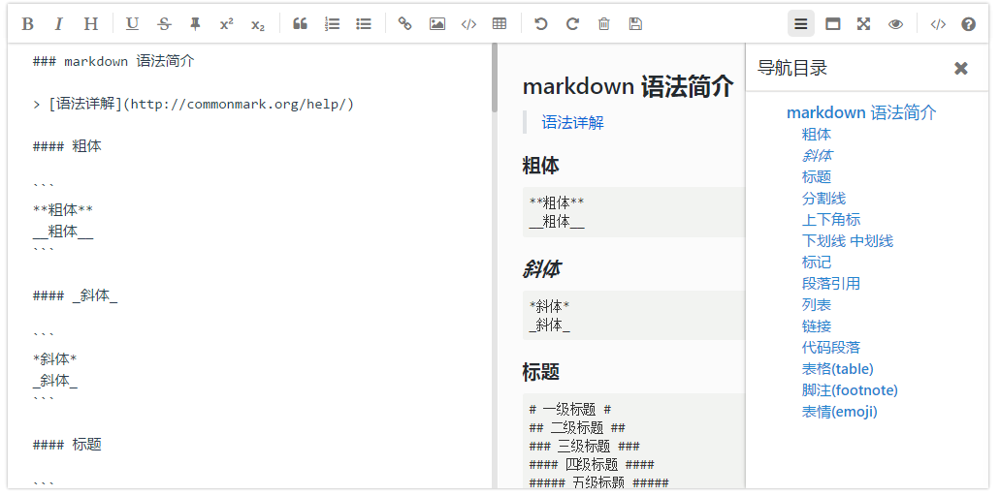
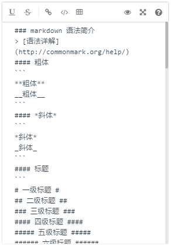
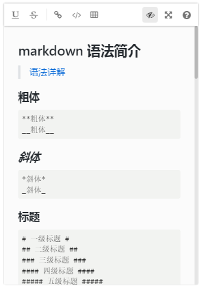

# mavonEditor


> 基于Vue的markdown编辑器

## example (图片展示)

### PC




### 移动


&nbsp;&nbsp;&nbsp;

## Use Setup (开始)

### Install mavon-editor (安装)

```
$ npm install mavon-editor --save
```

### package.json

```
"mavon-editor": "^1.5.2"
```

### Use (如何引入)

```javascript
    // 方法一
    // import with ES6
    import Vue from 'vue'
    import mavonEditor from 'mavon-editor'
    import 'mavon-editor/dist/css/index.css'

    // require with Webpack/Node.js
    var Vue = require('vue')
    var mavonEditor = require('mavon-editor')

    // use
    Vue.use(mavonEditor)
```

```javascript
    // 方法二
    // or use with component(ES6)
    import { mavonEditor } from 'mavon-editor'
    import 'mavon-editor/dist/css/index.css'

    export default {
      components: {
        mavonEditor
      }
    }
```
### html
``` html
    <!-- 使用双向绑定修饰符 -->
    <mavonEditor v-model="value"/>
```

``` html
    <!-- 当value发生改变 , 触发change事件 -->
    <mavonEditor :value="value" @change="function"/>
```

- **默认大小样式为 min-height: 300px , ming-width: 300px 可自行覆盖**
- **基础z-index: 1500**
- **单栏编辑模式下 , TAB键 主动触发markdown渲染**
- **屏幕分辨率低于768px ，自动取消【单栏 | 双栏】编辑模式 ，更改为【编辑 | 预览】切换 ， 并且取消【沉浸式阅读】模式( > 768px 的眼睛图标为【阅读模式】 , 反之为【编辑 |预览】)**
- **快捷键的监听对象更改为document，所以当多个编辑器共存时候（情况较少），只有最后一个编辑器的快捷键生效，更改前是对编辑器对象进行监听，失焦比较影响体验**

## API 文档

### props

| name 名称   | type 类型    |  default 默认值 | describe 描述 |
| -------- | :---------: | :------------: | ------- |
| value      | String      |               | 初始值 |
| scrollStyle| Boolean     |   true       | 开启滚动条样式(暂时仅支持chrome) |
| subfield   | Boolean     |   true        | 默认开启双栏编辑(单栏模式 TAB键主动触发markdown渲染) |
| toolbars   | Object      |   如下  | 工具栏 |

```javascript
 /*
    默认工具栏按钮全部开启, 传入自定义对象
    例如: {
         bold: true, // 粗体
         italic: true,// 斜体
         header: true,// 标题
    }
    此时, 仅仅显示此三个功能键
 */
toolbars: {
      bold: true, // 粗体
      italic: true, // 斜体
      header: true, // 标题
      underline: true, // 下划线
      strikethrough: true, // 中划线
      mark: true, // 标记
      superscript: true, // 上角标
      subscript: true, // 下角标
      quote: true, // 引用
      ol: true, // 有序列表
      ul: true, // 无序列表
      link: true, // 链接
      imagelink: true, // 图片链接
      code: true, // code
      table: true, // 表格
      subfield: true, // 是否需要分栏
      fullscreen: true, // 全屏编辑
      readmodel: true, // 沉浸式阅读
      htmlcode: true, // 展示html源码
      help: true, // 帮助
      /* 1.3.5 */
      undo: true, // 上一步
      redo: true, // 下一步
      trash: true, // 清空
      save: true, // 保存（触发events中的save事件）
      /* 1.4.2 */
      navigation: true // 导航目录
  }
```


### events

| name 方法名   | params 参数   | describe 描述 |
| -------- | :---------: | ------- |
| change   | String: value , String: reder    |  编辑区发生变化的回调事件(render: value 经过markdown解析后的结果) |
| save     | String: value , String: reder     |  ctrl + s 的回调事件(保存按键,同样触发该回调) |
| fullscreen | Boolean: status , String value     |  切换全屏编辑的回调事件(boolean: 全屏开启状态) |
| readmodel |  Boolean: status , String value    |  切换沉浸式阅读的回调事件(boolean: 阅读开启状态) |
| htmlcode | Boolean: status , String value     |查看html源码的回调事件(boolean: 源码开启状态) |
| subfieldtoggle  |  Boolean: status , String value     |  切换单双栏编辑的回调事件(boolean: 双栏开启状态) |
| helptoggle | Boolean: status , String value   |  查看帮助的回调事件(boolean: 帮助开启状态) |
| navigationtoggle | Boolean: status , String value   |  切换导航目录的回调事件(boolean: 导航开启状态) |

## Dependencies (依赖)

- [markdown-it](https://github.com/markdown-it/markdown-it)

- [auto-textarea](https://github.com/hinesboy/auto-textarea)

- [stylus](https://github.com/stylus/stylus)

## follow-up (后续)

- ~~撤销键、清空键、保存按钮~~（1.3.5）
- ~~重构~~（1.4.0）
- ~~支持开启标题导航~~(1.4.2)
- 支持图片上传
- 滚动条样式的浏览器兼容性
- 自定义工具栏功能键

## update(更新内容)
- **1.5.2** 优化项目结构(17.5.6 / [CHENXCHEN](https://github.com/CHENXCHEN))
            <br/>&emsp;&emsp;&emsp;- 将toolbar操作拆分为toolbar_left.js和toolbar_right.js
            <br/>&emsp;&emsp;&emsp;- 抽离stylus样式为markdown.css
            <br/>&emsp;&emsp;&emsp;- 调整md.css位置至lib/css
- **1.5.1** 添加postcss插件，压缩插件体积，分离markdown样式(样式需单独引入，参考上述用法)(17.5.6 / [CHENXCHEN](https://github.com/CHENXCHEN))
- **1.4.8** 优化项目结构,添加webpack-dev-server的开发测试(17.5.4 / [CHENXCHEN](https://github.com/CHENXCHEN)）
- **1.4.7** 图标局部引入,减少文件体积(17.4.26）
- **1.4.2** 支持开启标题导航 ,快捷键监听对象更改为document（17.4.25）
- **1.4.0** 重构代码（17.4.24）
- **1.3.5** 增加撤销键、清空键、保存按钮 , 修复底部展示不完整BUG
- **1.3.4** 多个编辑器快捷键/组合键监听覆盖 , props.toolbars 传递规则纠正(传入值整体覆盖默认值)
- **1.3.3** 多个编辑器z-index冲突
- **1.3.2** props 传递方法 更改为 v-on 绑定方法

## Collaborators(合作者)

- [CHENXCHEN](https://github.com/CHENXCHEN)

## contact(联系我)

QQ:
- 1109089240

EMAIL:
- 1109089240@qq.com
- hines.zhu@gmail.com
- zhu.hong.yu@outlook.com

**欢迎咨询与建议**

## Licence (证书)

mavonEditor is open source and released under the MIT Licence.

Copyright (c) 2017 hinesboy
