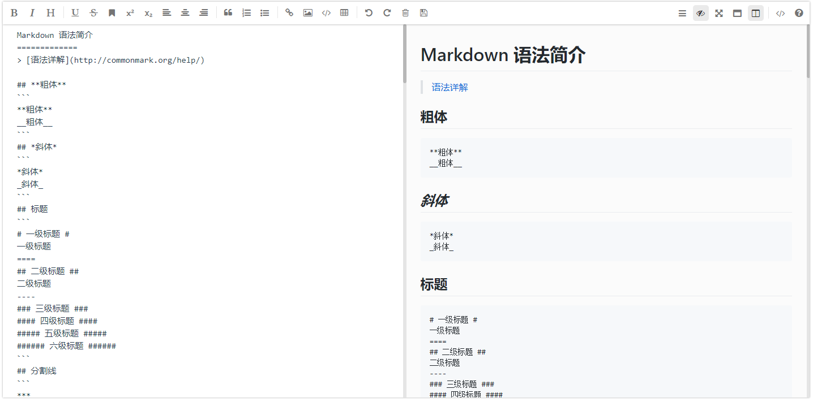
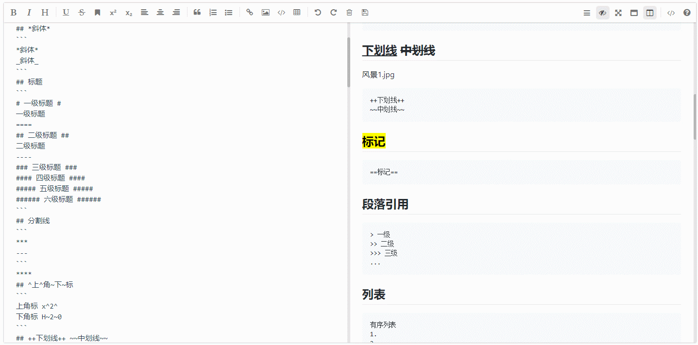

# mavonEditor


> 基于Vue的markdown编辑器

### [English Documents](./README-EN.md)
[Demo for jsfiddle](https://jsfiddle.net/CHENXCHEN/qf7gLw3a/3/)

## example (图片展示)

### PC





> [查看更多图片点击这里...](./doc/cn/images.md)

### Install mavon-editor (安装)

```
$ npm install mavon-editor --save
```

### Use (如何引入)

`index.js`:
```javascript
    // 全局注册
    // import with ES6
    import Vue from 'vue'
    import mavonEditor from 'mavon-editor'
    import 'mavon-editor/dist/css/index.css'
    // use
    Vue.use(mavonEditor)
    new Vue({
        'el': '#main',
        data() {
            return { value: '' }
        }
    })
```
`index.html`
```html
<div id="main">
    <mavon-editor v-model="value"/>
</div>
```
### 如何在nuxt.js 中使用
> 首先在工程目录plugins 下新建 vue-mavon-editor.js
``` javascrpt 
import Vue from 'vue';
import mavonEditor from 'mavon-editor';
import 'mavon-editor/dist/css/index.css';

Vue.use(mavonEditor);
```
> 然后在nuxt.config.js 中添加plugins配置
``` javascript
  plugins: [
  ...
    { src: '@/plugins/vue-mavon-editor', srr: false }
  ],
```
> 最后一步在页面或者组件中引入
```vue
<template>
  <div class="mavonEditor">
    <no-ssr>
      <mavon-editor :toolbars="markdownOption" v-model="handbook"/>
    </no-ssr>
  </div>
</template>
<script>
export default {
  data() {
    return {
      markdownOption: {
        bold: true, // 粗体
        ... // 更多配置
      },
      handbook: "#### how to use mavonEditor in nuxt.js"
    };
  }
};
</script>

<style scoped>
.mavonEditor {
  width: 100%;
  height: 100%;
}
</style>

```


> [更多引入方式点击这里...](./doc/cn/use.md)

> [如何获取并设置markdown-it对象...](./doc/cn/markdown.md)

## API 文档

### props

| name 名称      | type 类型 | default 默认值 | describe 描述                          |
| ------------ | :-----: | :---------: | ---------------------------------------- |
| value        | String  |             | 初始值                                     |
| language     | String  |     zh-CN      | 语言选择，暂支持 zh-CN: 中文简体 ， en: 英文 ， fr: 法语， pt-BR: 葡萄牙语， ru: 俄语， de: 德语， ja: 日语 |
| fontSize     | String  |     15px      | 编辑区域文字大小 |
| scrollStyle  | Boolean |    true     | 开启滚动条样式(暂时仅支持chrome)              |
| boxShadow     | Boolean  |     true     | 开启边框阴影                |
| boxShadowStyle | String | 0 2px 12px 0 rgba(0, 0, 0, 0.1) | 边框阴影样式 |
| transition | Boolean | true | 是否开启过渡动画 |
| toolbarsBackground | String | #ffffff | 工具栏背景颜色 |
| previewBackground | String | #fbfbfb | 预览框背景颜色 |
| subfield     | Boolean |    true     | true： 双栏(编辑预览同屏)， false： 单栏(编辑预览分屏)    |
| defaultOpen | String |         | edit： 默认展示编辑区域 ， preview： 默认展示预览区域  , 其他 = edit |
| placeholder | String |    开始编辑...     |  输入框为空时默认提示文本  |
| editable     | Boolean |    true     | 是否允许编辑     |
| codeStyle | String |    code-github     | markdown样式： 默认github, [可选配色方案](./src/lib/core/hljs/lang.hljs.css.js)   |
| toolbarsFlag | Boolean |    true     | 工具栏是否显示                |
| navigation | Boolean |    false    |  默认展示目录  |
| shortCut | Boolean |    true    |  是否启用快捷键  |
| autofocus | Boolean |    true    |  自动聚焦到文本框  |
| ishljs       | Boolean |     true     |  代码高亮 |
| imageFilter | function |     null     |  图片过滤函数，参数为一个`File Object`，要求返回一个`Boolean`, `true`表示文件合法，`false`表示文件不合法 |
| imageClick | function |     null     |  图片点击事件，默认为预览，可覆盖 |
| tabSize     | Number  |     \t     | tab转化为几个空格，默认为\t                      |
| toolbars     | Object  |     如下例     | 工具栏                      |

```javascript
 /*
    默认工具栏按钮全部开启, 传入自定义对象
    例如: {
         bold: true, // 粗体
         italic: true,// 斜体
         header: true,// 标题
    }
    此时, 仅仅显示此三个功能键
 */
toolbars: {
      bold: true, // 粗体
      italic: true, // 斜体
      header: true, // 标题
      underline: true, // 下划线
      strikethrough: true, // 中划线
      mark: true, // 标记
      superscript: true, // 上角标
      subscript: true, // 下角标
      quote: true, // 引用
      ol: true, // 有序列表
      ul: true, // 无序列表
      link: true, // 链接
      imagelink: true, // 图片链接
      code: true, // code
      table: true, // 表格
      fullscreen: true, // 全屏编辑
      readmodel: true, // 沉浸式阅读
      htmlcode: true, // 展示html源码
      help: true, // 帮助
      /* 1.3.5 */
      undo: true, // 上一步
      redo: true, // 下一步
      trash: true, // 清空
      save: true, // 保存（触发events中的save事件）
      /* 1.4.2 */
      navigation: true, // 导航目录
      /* 2.1.8 */
      alignleft: true, // 左对齐
      aligncenter: true, // 居中
      alignright: true, // 右对齐
      /* 2.2.1 */
      subfield: true, // 单双栏模式
      preview: true, // 预览
  }
```

### events 事件绑定

| name 方法名         |            params 参数            | describe 描述                              |
| ---------------- | :-----------------------------: | ---------------------------------------- |
| change           |  String: value , String: render  | 编辑区发生变化的回调事件(render: value 经过markdown解析后的结果) |
| save             |  String: value , String: render  | ctrl + s 的回调事件(保存按键,同样触发该回调)             |
| fullScreen       | Boolean: status , String: value | 切换全屏编辑的回调事件(boolean: 全屏开启状态)             |
| readModel        | Boolean: status , String: value | 切换沉浸式阅读的回调事件(boolean: 阅读开启状态)            |
| htmlCode         | Boolean: status , String: value | 查看html源码的回调事件(boolean: 源码开启状态)           |
| subfieldToggle   | Boolean: status , String: value | 切换单双栏编辑的回调事件(boolean: 双栏开启状态)            |
| previewToggle   | Boolean: status , String: value | 切换预览编辑的回调事件(boolean: 预览开启状态)            |
| helpToggle       | Boolean: status , String: value | 查看帮助的回调事件(boolean: 帮助开启状态)               |
| navigationToggle | Boolean: status , String: value | 切换导航目录的回调事件(boolean: 导航开启状态)             |
| imgAdd           | String: filename, File: imgfile | 图片文件添加回调事件(filename: 写在md中的文件名, File: File Object) |
| imgDel           |        String: filename         | 图片文件删除回调事件(filename: 写在md中的文件名)          |

#### 代码高亮

> 如不需要hightlight代码高亮显示，你应该设置ishljs为false

开启代码高亮props
```javascript
    // ishljs默认为true
    <mavon-editor :ishljs = "true"></mavon-editor>
```

为优化插件体积，从**v2.4.2**起以下文件将默认使用`cdnjs`外链:
 + `highlight.js`
 + `github-markdown-css`
 + `katex`(**v2.4.7**)

代码高亮`highlight.js`中的语言解析文件和代码高亮样式将在使用时按需加载.
`github-markdown-css`和`katex`仅会在`mounted`时加载

**Notice**:
[可选配色方案](./src/lib/core/hljs/lang.hljs.css.js) 和 [支持的语言](./src/lib/core/hljs/lang.hljs.js) 是从 [highlight.js/9.12.0](https://github.com/isagalaev/highlight.js/tree/master/src) 导出的

> [不使用cdn，本地按需加载点击这里...](./doc/cn/no-cnd.md)

#### 图片上传

```javascript
<template>
    <mavon-editor ref=md @imgAdd="$imgAdd" @imgDel="$imgDel"></mavon-editor>
</template>
exports default {
    methods: {
        // 绑定@imgAdd event
        $imgAdd(pos, $file){
            // 第一步.将图片上传到服务器.
           var formdata = new FormData();
           formdata.append('image', $file);
           axios({
               url: 'server url',
               method: 'post',
               data: formdata,
               headers: { 'Content-Type': 'multipart/form-data' },
           }).then((url) => {
               // 第二步.将返回的url替换到文本原位置 -> 
               /**
               * $vm 指为mavonEditor实例，可以通过如下两种方式获取
               * 1. 通过引入对象获取: `import {mavonEditor} from ...` 等方式引入后，`$vm`为`mavonEditor`
               * 2. 通过$refs获取: html声明ref : `<mavon-editor ref=md ></mavon-editor>，`$vm`为 `this.$refs.md`
               */
               $vm.$img2Url(pos, url);
           })
        }
    }
}
```
> [图片上传详情点击这里...](./doc/cn/upload-images.md)

### 注

- **默认大小样式为 min-height: 300px , min-width: 300px 可自行覆盖**
- **基础z-index: 1500**
- **仅用作展示可以设置props: toolbarsFlag: false , subfield: false, defaultOpen: "preview"**


### 快捷键

| key       | keycode  |            功能            |
| ---------------- | :----------------: | :-----------------------------: |
| F8           | 119 |  开启/关闭导航  |
| F9           | 120   |  预览/编辑切换  |
| F10     | 121   | 开启/关闭全屏 |
| F11      | 122   | 开启/关闭阅读模式 |
| F12       | 123   | 单栏/双栏切换 |
| TAB  | 9  | 缩进 |
| CTRL + S    | 17 + 83 | 触发保存 |
| CTRL + D    | 17 + 68 | 删除选中行 |
| CTRL + Z    | 17 + 90 | 上一步 |
| CTRL + Y    | 17 + 89 | 下一步 |
| CTRL + BreakSpace    | 17 + 8 | 清空编辑 |
| CTRL + B       | 17 + 66 | **加粗** |
| CTRL + I | 17 + 73 | *斜体* |
| CTRL + H       | 17 + 72 | # 标题 |
| CTRL + 1       | 17 + 97 or 49 | # 标题 |
| CTRL + 2       | 17 + 98 or 50 | ## 标题 |
| CTRL + 3       | 17 + 99 or 51 | ### 标题 |
| CTRL + 4       | 17 + 100 or 52 | #### 标题 |
| CTRL + 5       | 17 + 101 or 53 | ##### 标题 |
| CTRL + 6       | 17 + 102 or 54 | ###### 标题 |
| CTRL + U    | 17 + 85 | ++下划线++ |
| CTRL + M    | 17 + 77 | ==标记== |
| CTRL + Q    | 17 + 81 | > 引用 |
| CTRL + O    | 17 + 79 | 1. 有序列表 |
| CTRL + L    | 17 + 76 | [链接]() |
| CTRL + ALT + S    | 17 + 18 + 83 | ^上角标^ |
| CTRL + ALT + U    | 17 + 18 + 85 | - 无序列表 |
| CTRL + ALT + C    | 17 + 18 + 67 | ``` 代码块 |
| CTRL + ALT + L    | 17 + 18 + 76 |  |
| CTRL + ALT + T    | 17 + 18 + 84 | 表格 |
| CTRL + SHIFT + S    | 17 + 16 + 83 | ~下角标~ |
| CTRL + SHIFT + D    | 17 + 16 + 68 | ~~中划线~~ |
| CTRL + SHIFT + C    | 17 + 16 + 67 | 居中 |
| CTRL + SHIFT + L    | 17 + 16 + 76 | 居左 |
| CTRL + SHIFT + R    | 17 + 16 + 82 | 居右 |
| SHIFT + TAB    | 16 + 9 | 取消缩进 |


## Dependencies (依赖)

- [markdown-it](https://github.com/markdown-it/markdown-it)

- [auto-textarea](https://github.com/hinesboy/auto-textarea)


## Markdown 语法拓展

- [emoji](https://github.com/markdown-it/markdown-it-emoji)
- [subscript](https://github.com/markdown-it/markdown-it-sub)
- [superscript](https://github.com/markdown-it/markdown-it-sup)
- [container](https://github.com/markdown-it/markdown-it-container)
- [definition list](https://github.com/markdown-it/markdown-it-deflist)
- [abbreviation](https://github.com/markdown-it/markdown-it-abbr)
- [footnote](https://github.com/markdown-it/markdown-it-footnote)
- [insert](https://github.com/markdown-it/markdown-it-ins)
- [mark](https://github.com/markdown-it/markdown-it-mark)
- [todo list](https://github.com/revin/markdown-it-task-lists)
- [highlight](https://github.com/isagalaev/highlight.js)
- [katex](https://github.com/Khan/KaTeX)
- [images preview](https://github.com/CHENXCHEN/markdown-it-images-preview)
- [toc](https://github.com/tylerlong/markdown-it-toc)
- 可通过[获取markdown-it对象](./doc/cn/markdown.md)引入[其他语法插件](https://www.npmjs.com/search?q=keywords:markdown-it-plugin)

## update(更新内容)

- [更新日志](./LOG.md)

## Collaborators(合作者)

- [CHENXCHEN](https://github.com/CHENXCHEN)


## Licence (证书)

mavonEditor is open source and released under the MIT Licence.

Copyright (c) 2017 hinesboy
